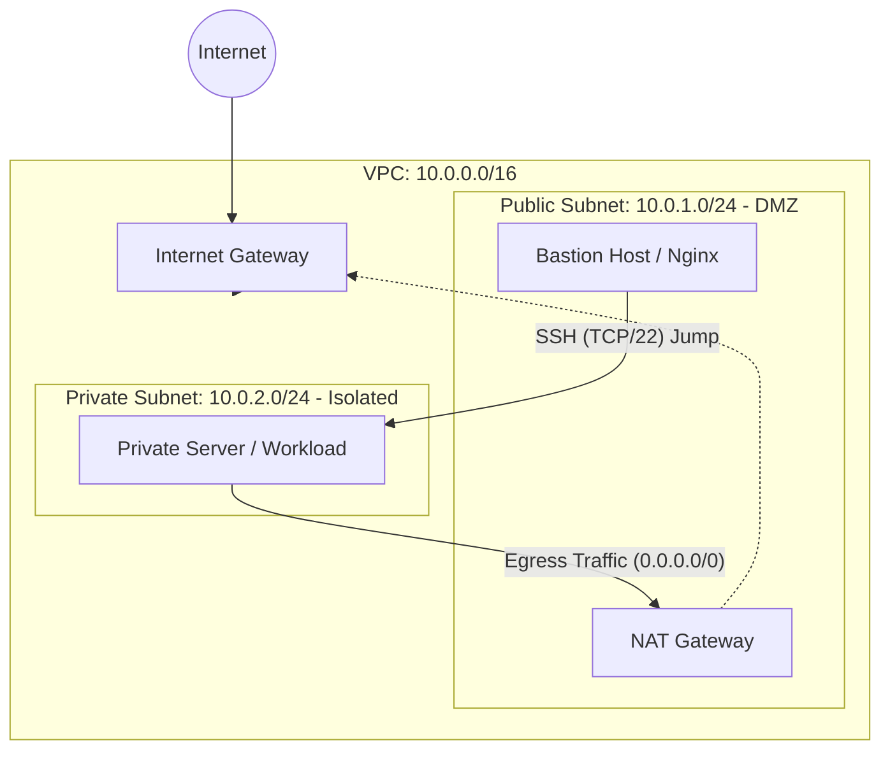
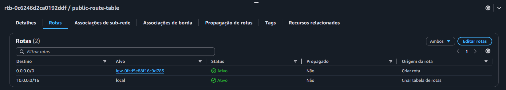

# AWS Secure Network Architecture & Bastion Host

[English](#english-version) | [Português](#portuguese-version)

---

## English Version

### Architecture Overview
This repository documents the deployment of a custom AWS Virtual Private Cloud (VPC) designed with strict network segmentation and Zero Trust security principles. The architecture isolates internal workloads from the public internet while maintaining secure, controlled administrative access via a Bastion Host (Jump Server), and provides secure outbound internet access for private workloads via a NAT Gateway.

### Network Topology

### Technical Specifications

| Component | CIDR / Type | Description / Routing |
| :--- | :--- | :--- |
| **VPC** | `10.0.0.0/16` | Custom deployment providing a broad internal IP address space. |
| **Public Subnet** | `10.0.1.0/24` | Features an explicit route to the Internet Gateway (`0.0.0.0/0`). Hosts the NAT Gateway. |
| **Private Subnet** | `10.0.2.0/24` | Complete inbound isolation. Outbound traffic routed strictly through the NAT Gateway. |
| **NAT Gateway** | Elastic IP | Placed in the Public Subnet to perform Source NAT for private resources. |
| **Compute** | `t2.micro` | Ubuntu 24.04 LTS instances deployed in both subnets. |

### Network Traffic & Security Flow

Security Groups and Route Tables were configured enforcing the principle of least privilege:

**1. Public Access (Bastion Host)**
* **Ingress**: TCP/22 (SSH) strictly locked to the Administrator's public IP address. TCP/80 (HTTP) open to `0.0.0.0/0` to validate external web server connectivity.
* **Egress**: Unrestricted outbound access.

**2. Private Workloads & NAT Routing**
* **Ingress (Zero Trust)**: Direct access from the internet is explicitly denied. TCP/22 (SSH) is restricted to accept connections only from the Public Subnet CIDR (`10.0.1.0/24`).
* **Egress (Source NAT)**: The private instance lacks a public IP. The private route table directs `0.0.0.0/0` traffic to the NAT Gateway in the public subnet, which translates the private IP to its Elastic IP, allowing safe outbound internet requests (e.g., system updates) while rejecting unsolicited inbound connections.

### Validation & Testing

* `[x]` **Ingress Validation:** Nginx provisioned on the Bastion Host successfully responds to external HTTP requests.
* `[x]` **Secure Jump:** SSH key-forwarding tested; successfully authenticated to the private server exclusively through the Bastion Host.
* `[x]` **Egress Validation:** Outbound ICMP (`ping 8.8.8.8`) and package update operations (`apt update`) from the Private Subnet successfully reached the internet via the NAT Gateway.

#### Evidences

**Public Route Table (IGW Attached)**

**Egress Validation (Ping via NAT Gateway)**

---

## Portuguese Version

### Visão Geral da Arquitetura
Este repositório documenta o provisionamento de uma AWS Virtual Private Cloud (VPC) customizada, projetada com segmentação de rede rigorosa e princípios de segurança Zero Trust. A arquitetura isola as cargas de trabalho internas da internet pública, mantendo o acesso administrativo seguro e controlado através de um Bastion Host (Jump Server), e provê acesso de saída seguro à internet para os servidores privados via um NAT Gateway.

### Especificações Técnicas

| Componente | CIDR / Tipo | Descrição / Roteamento |
| :--- | :--- | :--- |
| **VPC** | `10.0.0.0/16` | Implementação fornecendo amplo espaço de endereçamento interno. |
| **Sub-rede Pública** | `10.0.1.0/24` | Possui rota explícita para o Internet Gateway (`0.0.0.0/0`). Hospeda o NAT Gateway. |
| **Sub-rede Privada** | `10.0.2.0/24` | Isolamento de entrada (inbound) total. Tráfego de saída roteado pelo NAT Gateway. |
| **NAT Gateway** | IP Elástico | Posicionado na Sub-rede Pública para realizar Source NAT dos recursos privados. |
| **Compute** | `t2.micro` | Instâncias Ubuntu 24.04 LTS em ambas as sub-redes. |

### Fluxo de Rede e Segurança

Os Security Groups e Tabelas de Rotas aplicam estritamente o princípio do menor privilégio (least privilege):

**1. Acesso Público (Bastion Host)**
* **Ingress**: TCP/22 (SSH) bloqueado explicitamente para o IP público do Administrador. TCP/80 (HTTP) aberto para `0.0.0.0/0` para validar a conectividade externa do servidor web.
* **Egress**: Acesso de saída irrestrito.

**2. Cargas de Trabalho Privadas e Roteamento NAT**
* **Ingress (Zero Trust)**: Acesso direto da internet é explicitamente negado. TCP/22 (SSH) é restrito para conexões oriundas apenas do CIDR da Sub-rede Pública (`10.0.1.0/24`).
* **Egress (Source NAT)**: A instância privada não possui IP público. A tabela de rotas privada direciona o tráfego `0.0.0.0/0` para o NAT Gateway na sub-rede pública, que traduz o IP privado para o seu IP Elástico, permitindo requisições de saída seguras (ex: atualizações de sistema) enquanto rejeita conexões de entrada não solicitadas.

### Validação e Testes

* `[x]` **Validação de Ingress:** Nginx no Bastion Host responde com sucesso a requisições HTTP externas.
* `[x]` **Salto Seguro (Jump):** Autenticação no servidor privado realizada com sucesso exclusivamente através do Bastion Host.
* `[x]` **Validação de Egress:** Requisições ICMP (`ping 8.8.8.8`) e atualizações de pacotes (`apt update`) a partir da Sub-rede Privada alcançaram a internet com sucesso através do NAT Gateway.

#### Evidências

**Tabela de Rotas Pública (com IGW)**

**Validação de Egress (Ping via NAT Gateway)**

