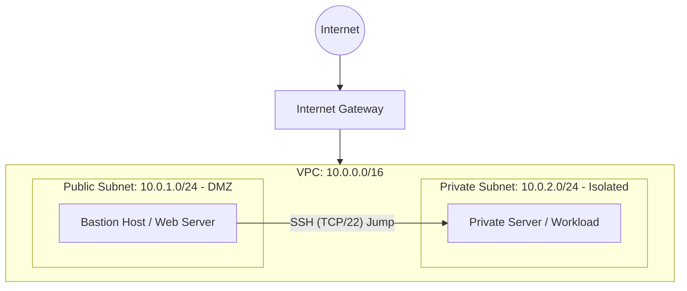
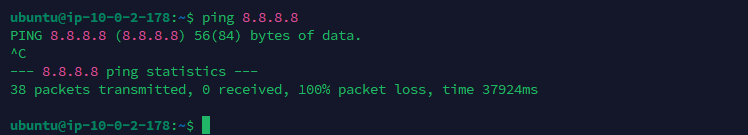

# AWS Secure Network Architecture & Bastion Host

[English](#english-version) | [Português](#portuguese-version)

---

## English Version

### Architecture Overview
This repository documents the deployment of a custom AWS Virtual Private Cloud (VPC) designed with strict network segmentation and Zero Trust security principles. The architecture isolates internal workloads from the public internet while maintaining secure, controlled administrative access via a Bastion Host (Jump Server).

### Network Topology

### Technical Specifications

| Component | CIDR / Type | Description / Routing |
| :--- | :--- | :--- |
| **VPC** | `10.0.0.0/16` | Custom deployment providing a broad internal IP address space. |
| **Public Subnet** | `10.0.1.0/24` | Features an explicit route to the Internet Gateway (`0.0.0.0/0`). |
| **Private Subnet** | `10.0.2.0/24` | No internet egress/ingress. Operates in complete isolation. |
| **Compute** | `t2.micro` | Ubuntu 24.04 LTS instances deployed in both subnets. |

### Security Policies (Security Groups)
Security Groups were configured enforcing the principle of least privilege:

**1. Public SG (Bastion Host)**
* `Inbound`: TCP/22 (SSH) strictly locked to the Administrator's public IP address.
* `Inbound`: TCP/80 (HTTP) open to `0.0.0.0/0` (for Web Server validation).

**2. Private SG (Internal Workloads)**
* `Inbound`: TCP/22 (SSH) restricted to accept connections ONLY from the Public Subnet CIDR (`10.0.1.0/24`).
* Direct access from the internet is explicitly denied.

### Validation & Testing
* **Ingress Validation:** Nginx provisioned on the Bastion Host successfully responds to external HTTP requests.
* **Secure Jump:** SSH key-forwarding tested; successfully authenticated to the private server exclusively through the Bastion Host.
* **Egress Isolation:** ICMP requests (`ping 8.8.8.8`) from the Private Subnet resulted in absolute packet loss, confirming the absence of a NAT Gateway and complete environment isolation.

#### Evidences

**Public Route Table (IGW Attached)**

**Private Subnet Isolation (Ping Drop)**

---

## Portuguese Version

### Visão Geral da Arquitetura
Este repositório documenta o provisionamento de uma AWS Virtual Private Cloud (VPC) customizada, projetada com segmentação de rede rigorosa e princípios de segurança Zero Trust. A arquitetura isola as cargas de trabalho internas da internet pública, mantendo o acesso administrativo seguro e controlado através de um Bastion Host (Jump Server).

### Especificações Técnicas

| Componente | CIDR / Tipo | Descrição / Roteamento |
| :--- | :--- | :--- |
| **VPC** | `10.0.0.0/16` | Implementação fornecendo amplo espaço de endereçamento interno. |
| **Sub-rede Pública** | `10.0.1.0/24` | Possui rota explícita para o Internet Gateway (`0.0.0.0/0`). |
| **Sub-rede Privada** | `10.0.2.0/24` | Sem rotas de saída/entrada para a internet. Isolamento total. |
| **Compute** | `t2.micro` | Instâncias Ubuntu 24.04 LTS em ambas as sub-redes. |

### Políticas de Segurança (Security Groups)
Os Security Groups aplicam estritamente o princípio do menor privilégio (least privilege):

**1. Security Group Público (Bastion Host)**
* `Inbound`: TCP/22 (SSH) bloqueado explicitamente para o IP público do Administrador.
* `Inbound`: TCP/80 (HTTP) aberto para internet (`0.0.0.0/0`).

**2. Security Group Privado (Internal Workloads)**
* `Inbound`: TCP/22 (SSH) restrito para conexões oriundas APENAS do CIDR da Sub-rede Pública (`10.0.1.0/24`).
* Acesso direto da internet é negado por padrão.

### Validação e Testes
* **Validação de Ingress:** Nginx no Bastion Host responde com sucesso a requisições HTTP externas.
* **Salto Seguro (Jump):** Autenticação no servidor privado realizada com sucesso exclusivamente através do Bastion Host.
* **Isolamento de Egress:** Requisições ICMP (`ping 8.8.8.8`) a partir da Sub-rede Privada resultaram em perda total de pacotes, confirmando a ausência de NAT Gateway e o isolamento do ambiente.

#### Evidências

**Tabela de Rotas Pública (com IGW)**

**Isolamento da Sub-rede Privada (Ping Falhou)**

